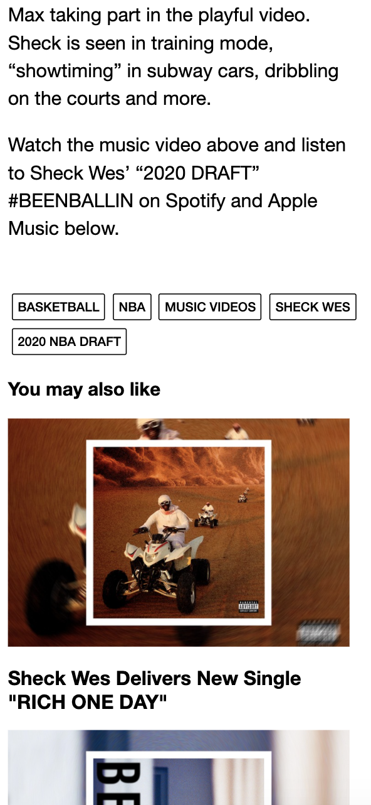
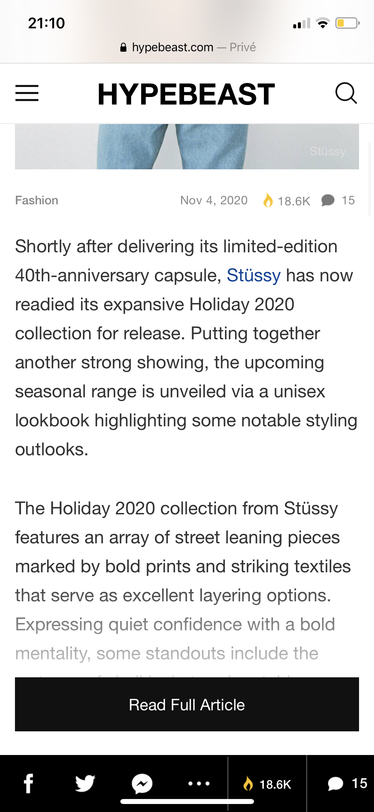

# Procesverslag
**Auteur:** Zain Butt

Markdown cheat cheet: [Hulp bij het schrijven van Markdown](https://github.com/adam-p/markdown-here/wiki/Markdown-Cheatsheet). Nb. de standaardstructuur en de spartaanse opmaak zijn helemaal prima. Het gaat om de inhoud van je procesverslag. Besteedt de tijd voor pracht en praal aan je website.

## Bronnenlijst
1. https://css-tricks.com/snippets/css/a-guide-to-flexbox/
2. FED opdrachten

## Eindgesprek (week 7/8)

-dit ging goed & dit was lastig-
Het begon allemaal wel goed, maar kwam op het laatst wel in de knoop met enkele dingen. Ik heb in de kerstvakantie er tijd in gestopt maar met de motivatieproblemen die ik had heb ik niet kunnen realiseren wat het zou moeten zijn. Ook het zo min mogelijk gebruiken van classes en id is niet helemaal gelukt, ik vond met pseudoclasses werken ook niet bepaald praktischer.

**Screenshot(s):**

-screenshot(s) van je eindresultaat-

## Voortgang 3 (week 6)

-dit ging goed & dit was lastig-
Ik heb deze week niet echt veel gedaan om eerlijk te zijn.

**Screenshot(s):**

### Agenda voor meeting

-samen met je groepje opstellen-

| Stijn                 | Sara                           | Tim                              | Julius           |
| ---                   | ---                            | ---                              | ---              |
| JS CSS aanspreken     |                                |                                  |                  |
|                       |                                |                                  |                  |
|                       |                                |                                  |                  |
|                       |                                |                                  |                  |

### Verslag van meeting

-na afloop snel uitkomsten vastleggen-
Niemand had echt vragen, dus we waren snel klaar.

## Voortgang 2 (week 5)

-dit ging goed & dit was lastig-
Ben voor een groot deel klaar met mobiele versie en ga binnenkort aan de responsiveness werken.

**Screenshot(s):**

### Agenda voor meeting

-samen met je groepje opstellen-

| Stijn          | Sara                           | Tim                              | Julius           |
| ---            | ---                            | ---                              | ---              |
| Header boven   | Hoe wordt button een vergroot  | Foto als achtergrond             |                  |
| de main, z-indx| glas                           | Brackets preview spacet          |                  |
|                |                                |                                  |                  |
|                |                                |                                  |                  |

### Verslag van meeting

-na afloop snel uitkomsten vastleggen-
Het ging allemaal goed. Voor de icons kan bijvoorbeeld font awesome gebruikt worden en die live preview kan je beter van af blijven.

## Voortgang 1 (week 3)

### Stand van zaken

-dit ging goed & dit was lastig-
De meeste content is toegevoegd aan de HTML en ben begonnen met beide pagina's deels te stylen. Tot nu toe niet echt problemen waar ik tegenaan liep.

**Screenshot(s):**

### Agenda voor meeting

-samen met je groepje opstellen-

| Stijn             | Sara                           | Tim                              | Julius           |
| ---               | ---                            | ---                              | ---              |
| Oneindige loop    | Wanneer teveel classes         | Dropdown over tekst              |                  |
| foto & tekst      |                                | Navigatie naar zelfde contnt     |                  |
| veranderen 5s     |                                | Hoe kan ik zien welke icon       |                  |
|                   |                                |                                  |                  |

### Verslag van meeting

Ging goed allemaal, er werd gezegd om niet al teveel classes te gebruiken maar vooral te beginnen met algemeen stylen en daarna classes.

## Breakdownschets (week 1)

## Intake (week 1)
-uitwerken voor de kick-off werkgroep - begin van de eerste week-

**Je startniveau:** Rood

**Je focus:** Responsive

**Je opdracht:** hypebeast.com

**Screenshot(s) van de eerste pagina (small screen):**

**Screenshot(s) van de tweede pagina (small screen):**

